# Plasma Research Portal 연구자 사용 안내서

대상 사이트: http://172.21.38.128:3000/

이 문서는 연구자에게 포털의 각 페이지 기능과 실제 사용 방법을 설명하기 위한 안내서입니다.
`dashboard`, `게시물`, `멤버` 화면은 제외하고, 연구 실무에 직접 사용하는 화면만 정리했습니다.

> 캡처 이미지 기준일: 2026-03-27  
> 이미지 위치: `docs/images/researcher-portal/`

---

## 1. 전체 사용 흐름

처음 사용하는 연구자에게는 아래 순서로 설명하면 이해가 쉽습니다.

1. `메인 페이지`에서 전체 연구 흐름을 확인합니다.
2. `로그인` 후 `내 프로필`에서 기본 계정을 확인합니다.
3. `PDF 임베딩`에서 논문 PDF를 업로드하고 컬렉션을 만듭니다.
4. `연구 주제 발굴`, `이론 연구`, `Agent`에서 문헌 기반 탐색을 시작합니다.
5. `데이터 분석`, `진단`, `예측`, `계산기`로 분석을 심화합니다.
6. `실험 관리`, `실험 데이터셋`에서 실험 기록과 결과를 구조화합니다.
7. `협업`에서 프로젝트 공유와 보고서 초안 생성을 진행합니다.

---

## 2. 시작 화면과 계정 관련 페이지

### 2.1 메인 페이지
- URL: `/main`
- 역할: 포털 전체가 어떤 흐름으로 연결되는지 소개하는 랜딩 페이지입니다.
- 주요 기능:
  - 연구 워크플로우 요약
  - 주요 화면 바로가기
  - 워크스페이스 소개 카드
  - 연구 단계별 흐름 설명
  - 운영 프리뷰 대시형 카드
- 사용하는 방법:
  1. 처음 접속한 연구자에게 전체 연구 프로세스를 먼저 보여줍니다.
  2. `워크스페이스 시작하기`로 로그인 화면으로 이동합니다.
  3. `연구 화면 둘러보기`나 화면별 바로가기로 필요한 기능 설명을 시작합니다.

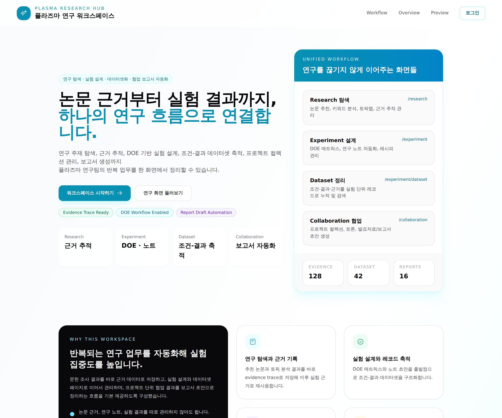

### 2.2 로그인
- URL: `/access`
- 역할: 계정 인증을 수행하는 진입 화면입니다.
- 주요 기능:
  - 이메일 입력
  - 비밀번호 입력
  - Enter 키 로그인
- 사용하는 방법:
  1. 연구자 계정 이메일과 비밀번호를 입력합니다.
  2. `로그인` 버튼을 누르거나 Enter 키를 눌러 접속합니다.
  3. 로그인 후 연구 화면으로 이동해 기능을 사용합니다.

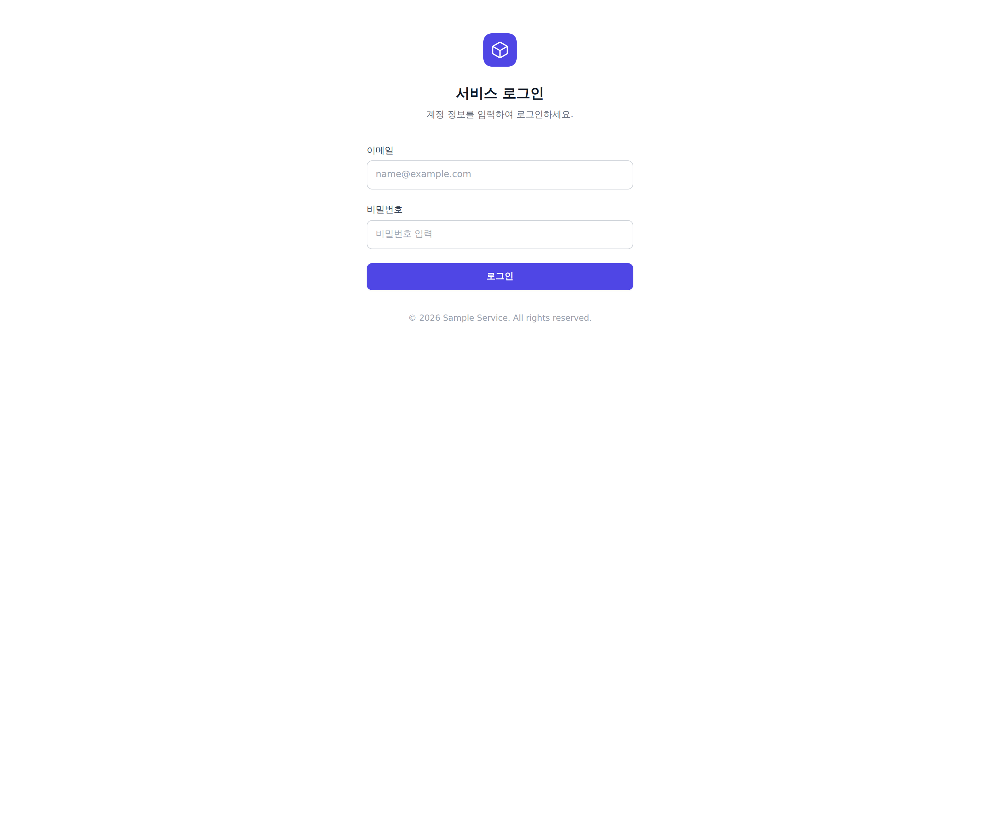

### 2.3 내 프로필
- URL: `/mypage`
- 역할: 계정 기본 정보와 비밀번호를 관리하는 개인 설정 화면입니다.
- 주요 기능:
  - 로그인 상태 확인
  - 이름 수정
  - 연락처 수정
  - 비밀번호 변경
  - 역할 표시(admin/user)
- 사용하는 방법:
  1. 로그인한 뒤 프로필 화면으로 이동합니다.
  2. 이름과 연락처를 최신 정보로 수정합니다.
  3. 비밀번호 변경이 필요하면 현재 비밀번호와 새 비밀번호를 입력해 갱신합니다.
- 비고:
  - 로그인하지 않은 경우 로그인 필요 안내 화면이 먼저 보입니다.

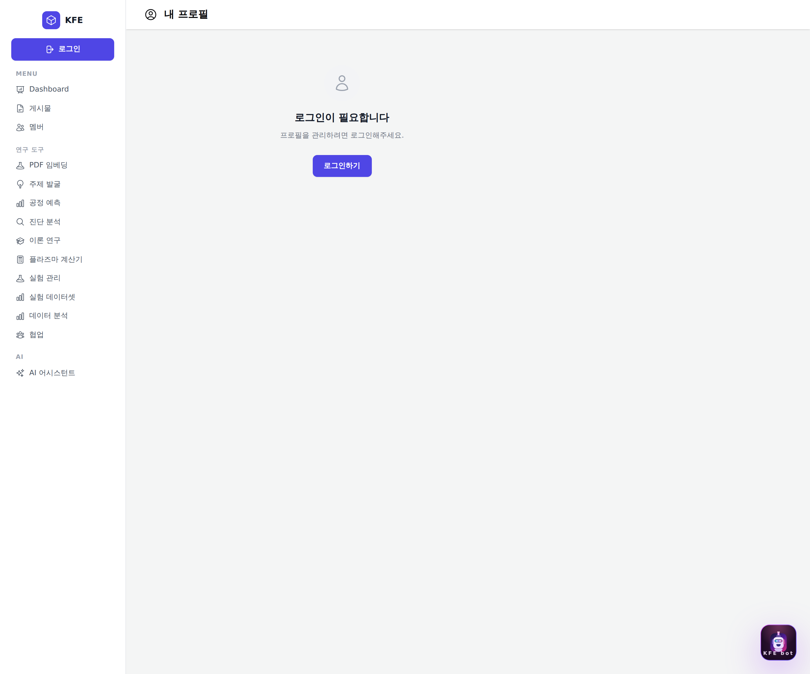

---

## 3. 데이터 준비와 문헌 기반 연구

### 3.1 PDF 임베딩
- URL: `/embedding`
- 역할: 논문 PDF를 검색 가능한 컬렉션으로 만드는 데이터 준비의 출발점입니다.
- 주요 기능:
  - 임베딩 모델 선택
  - 컬렉션 생성/선택/삭제
  - PDF 다중 업로드
  - 청크 크기/오버랩 조정
  - 추출 미리보기
  - 처리 로그 및 통계 확인
- 사용하는 방법:
  1. 임베딩 모델을 선택합니다.
  2. 새 컬렉션을 만들거나 기존 컬렉션을 선택합니다.
  3. PDF 논문 파일을 업로드합니다.
  4. 필요 시 청킹 옵션을 조정합니다.
  5. 임베딩을 실행하고 로그와 통계를 확인합니다.

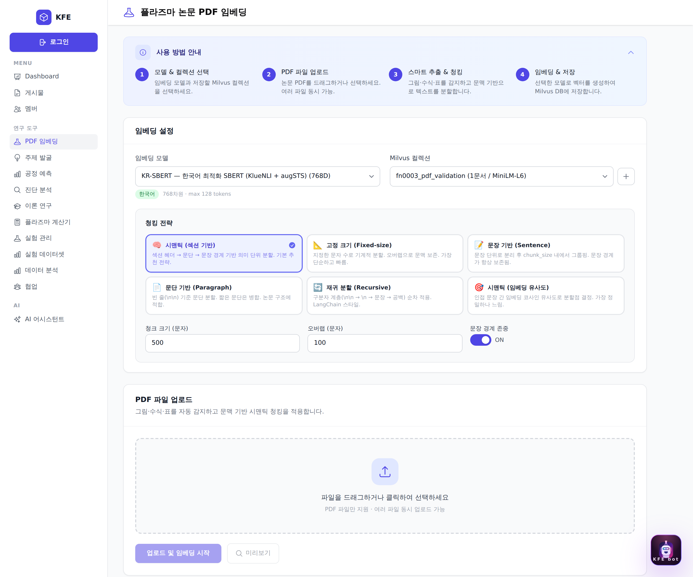

### 3.2 연구 주제 발굴
- URL: `/research`
- 역할: 컬렉션 안의 논문을 바탕으로 연구 주제, 가설, 공백 영역을 탐색하는 핵심 연구 화면입니다.
- 주요 기능:
  - 컬렉션 선택
  - 연구 질문 입력
  - 추천 주제 확인
  - Research Gap Detector
  - 가설 생성
  - 키워드 분석
  - 논문 추천
  - 제안서 생성
  - PDF 원문 열기
- 사용하는 방법:
  1. 먼저 사용할 컬렉션을 선택합니다.
  2. 연구 질문이나 키워드를 입력합니다.
  3. 추천 주제와 근거 논문을 확인합니다.
  4. 필요하면 갭 분석이나 가설 생성 기능으로 확장합니다.
  5. 의미 있는 결과는 PDF 원문까지 열어 검토합니다.

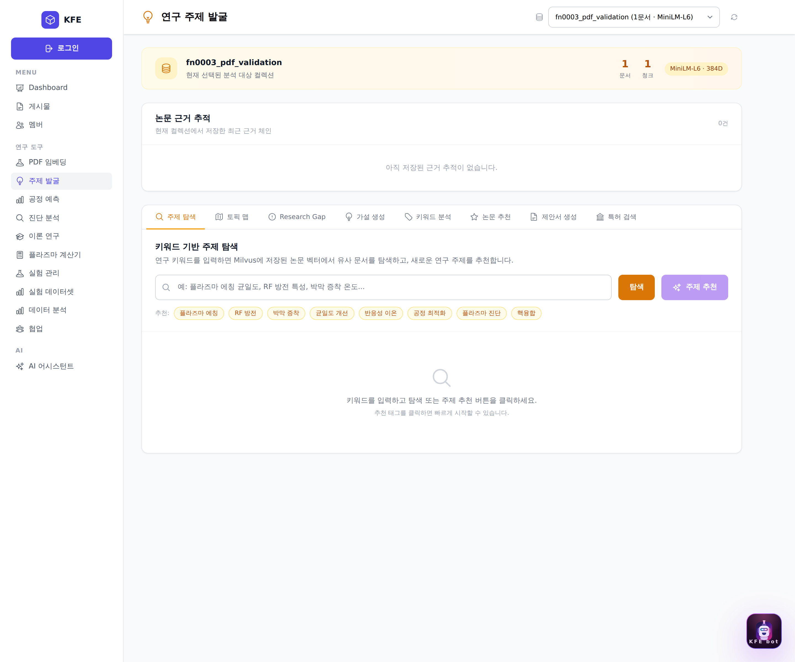

### 3.3 이론 연구
- URL: `/theory`
- 역할: 문헌에 등장하는 수식, 가정, 개념 관계를 정리해 이론 검토를 돕는 화면입니다.
- 주요 기능:
  - 수식 검색
  - 수식 분류/통계
  - 전체 수식 추출
  - 가정 검증
  - 문서 간 호환성 비교
  - 이론 그래프 구축/탐색
- 사용하는 방법:
  1. 컬렉션을 선택합니다.
  2. 수식 또는 가정 기준으로 검색합니다.
  3. 논문별 수식 차이와 가정 차이를 비교합니다.
  4. 그래프를 통해 개념 연결과 영향 관계를 확인합니다.

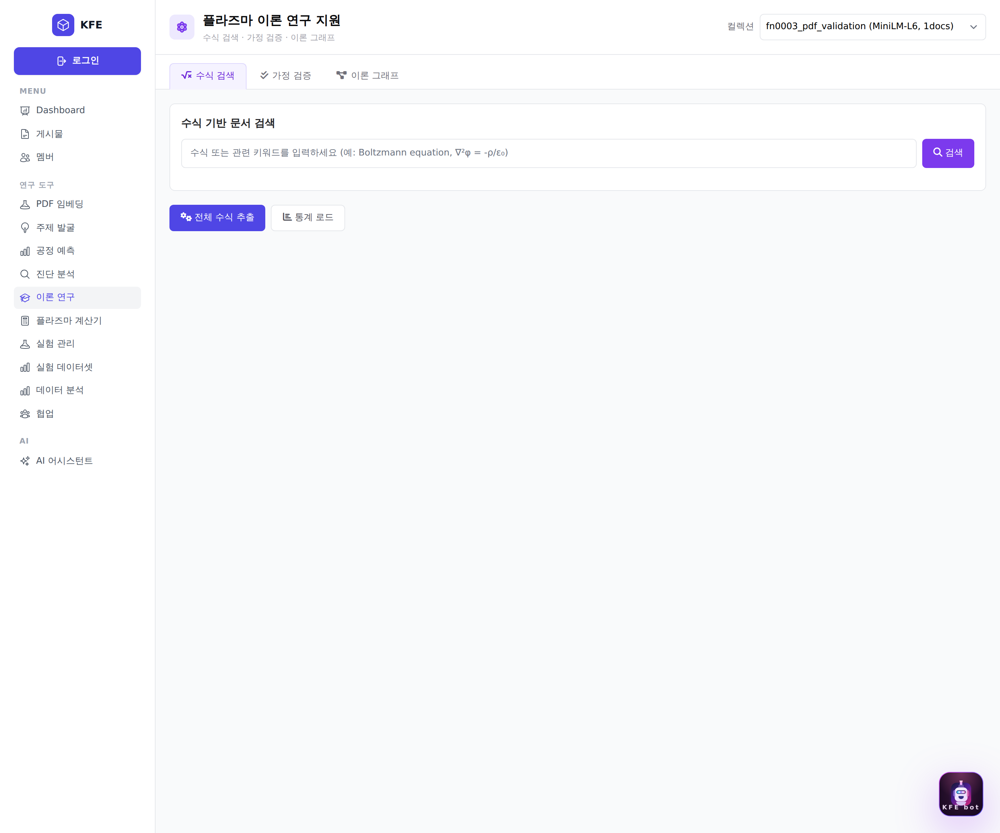

### 3.4 Agent
- URL: `/agent`
- 역할: 자연어 질문을 받아 적합한 연구 흐름과 페이지를 찾아주는 AI 연구 어시스턴트입니다.
- 주요 기능:
  - 컬렉션 선택
  - 추천 질문 버튼
  - 스트리밍 응답
  - 답변 생성 과정 카드 표시
  - 페이지 이동 카드
  - 실행 결과 카드
  - 품질 분석 카드
  - 근거 문헌 카드
- 사용하는 방법:
  1. 컬렉션을 먼저 선택합니다.
  2. 질문을 입력하거나 추천 질문을 눌러 시작합니다.
  3. 에이전트가 어떤 경로로 답을 만드는지 과정을 확인합니다.
  4. 필요하면 자동 추천된 페이지로 이동해 후속 작업을 이어갑니다.

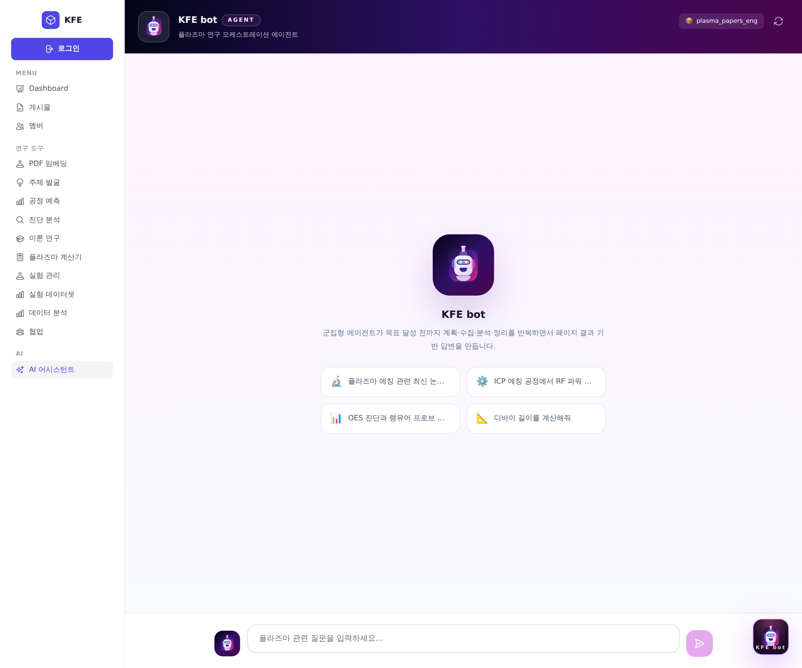

---

## 4. 분석, 진단, 예측 도구

### 4.1 데이터 분석
- URL: `/analysis`
- 역할: 수치 데이터를 빠르게 시각화하고 통계/피팅 분석을 수행하는 범용 분석 페이지입니다.
- 주요 기능:
  - 데이터 플로터
  - 차트 시각화
  - 기초 통계
  - 커브 피팅
  - 최근 분석 이력 확인
- 사용하는 방법:
  1. 데이터를 입력하거나 불러옵니다.
  2. 플롯/통계/피팅 중 필요한 분석 탭을 선택합니다.
  3. X/Y 축 또는 피팅 모델을 선택합니다.
  4. 그래프와 지표를 확인하며 결과를 해석합니다.

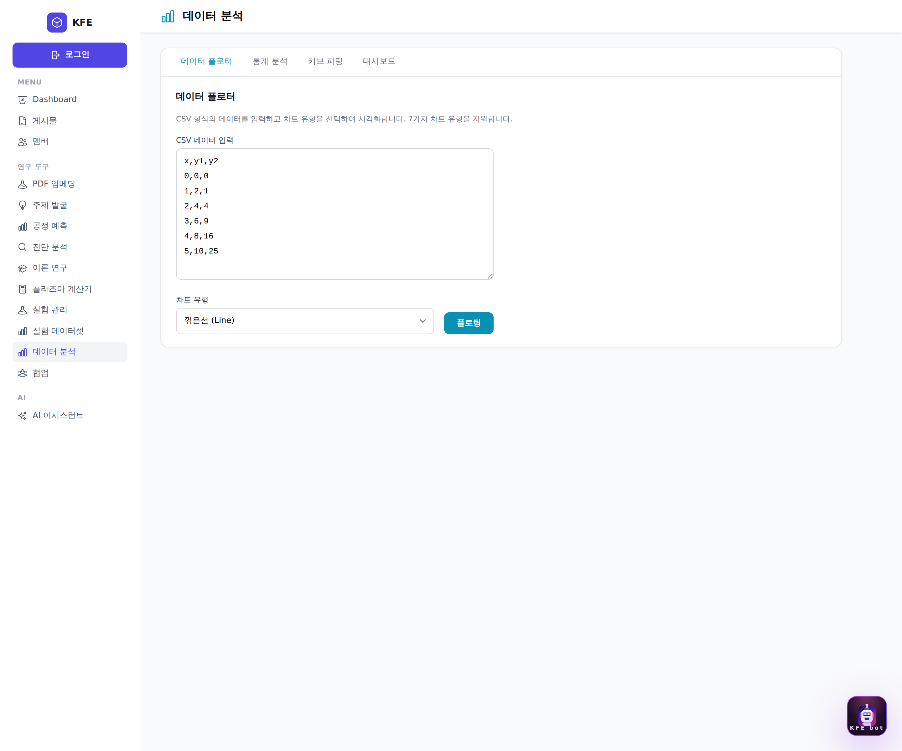

### 4.2 진단 데이터 분석
- URL: `/diagnosis`
- 역할: 플라즈마 진단 데이터와 문헌을 함께 활용해 이상 탐지와 고장 진단을 수행하는 화면입니다.
- 주요 기능:
  - 진단 방법별 문헌 검색
  - OES 스펙트럼 업로드
  - 유사 스펙트럼 검색
  - 관련 논문 검색
  - 멀티모달 검색
  - 이상 탐지
  - 고장 원인 분석
  - 진단 방법 비교
- 사용하는 방법:
  1. 컬렉션을 선택합니다.
  2. 스펙트럼 데이터 또는 진단 키워드를 입력합니다.
  3. 유사 사례와 관련 논문을 함께 확인합니다.
  4. 이상 탐지와 원인 분석 기능으로 문제 후보를 좁힙니다.

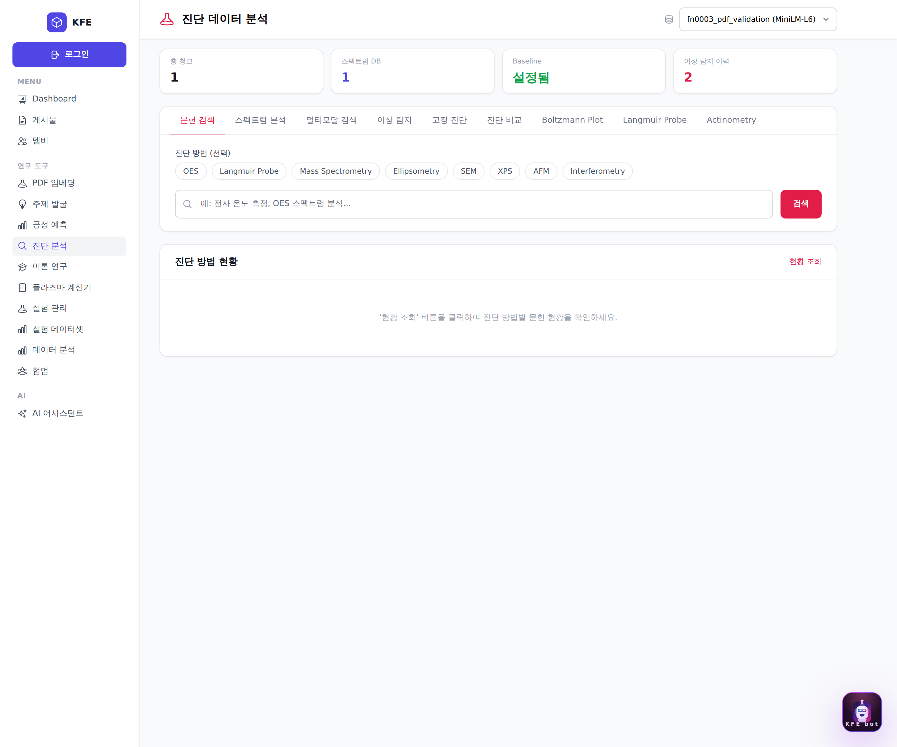

### 4.3 공정 예측 모델링
- URL: `/prediction`
- 역할: 조건에 따른 공정 결과를 예측하거나 목표 결과를 만족하는 조건을 역설계하는 화면입니다.
- 주요 기능:
  - 조건 예측
  - Surrogate Model 기반 예측
  - 신뢰구간 확인
  - 파라미터 DB 추출 및 통계
  - 역설계
  - 불확실성 분석
  - 파라미터 영향 분석
- 사용하는 방법:
  1. 컬렉션을 선택합니다.
  2. 현재 조건 또는 목표 결과를 입력합니다.
  3. 예측 또는 역설계를 실행합니다.
  4. 추천 조건과 신뢰도, 영향 분석 결과를 확인합니다.

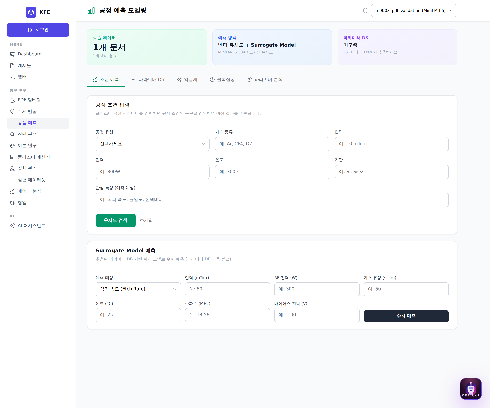

### 4.4 플라즈마 계산기
- URL: `/calculator`
- 역할: 플라즈마 연구에 필요한 기본 계산과 참조 정보를 빠르게 확인하는 유틸리티 화면입니다.
- 주요 기능:
  - Debye 길이 계산
  - 플라즈마 주파수 계산
  - 단위 변환
  - 물리 상수 검색
  - 주요 수식 참고
  - Paschen 곡선 계산
  - 가스 DB
  - 장비 참조표
- 사용하는 방법:
  1. 계산 또는 참조 탭을 선택합니다.
  2. 입력값을 넣습니다.
  3. 계산 결과와 참고 데이터를 확인합니다.
  4. 실험 준비나 결과 해석에 바로 활용합니다.

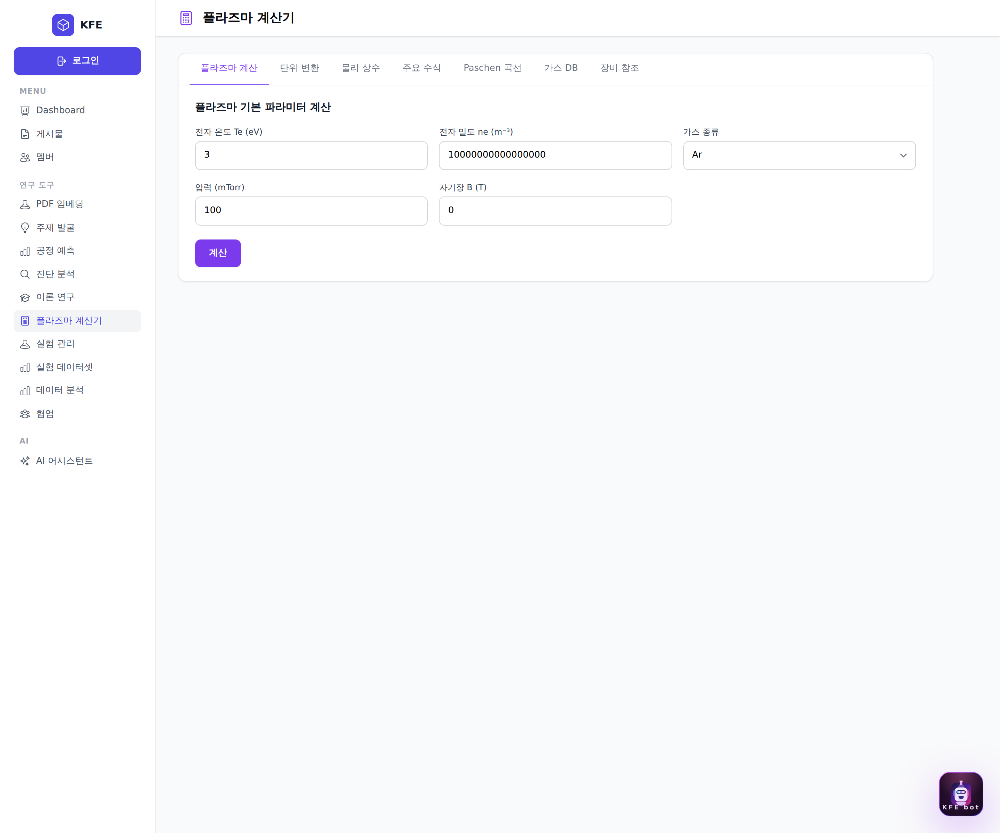

---

## 5. 실험 운영과 결과 관리

### 5.1 실험 관리
- URL: `/experiment`
- 역할: DOE 설계, 실험 노트, 레시피 관리를 한 화면에서 수행하는 페이지입니다.
- 주요 기능:
  - DOE 인자 추가/삭제
  - 범위와 수준 기반 설계 생성
  - 실험 매트릭스 확인
  - 실험 노트 작성/검색/수정/삭제
  - AI 노트 초안 생성
  - 레시피 생성/수정/삭제
  - 데이터셋 화면 연결
- 사용하는 방법:
  1. DOE 탭에서 변수와 수준을 입력합니다.
  2. 설계를 생성해 실험 조합을 확인합니다.
  3. 노트 탭에서 실험 기록을 남깁니다.
  4. 자주 쓰는 조건은 레시피로 저장합니다.
  5. 결과는 데이터셋 페이지로 넘겨 구조화합니다.

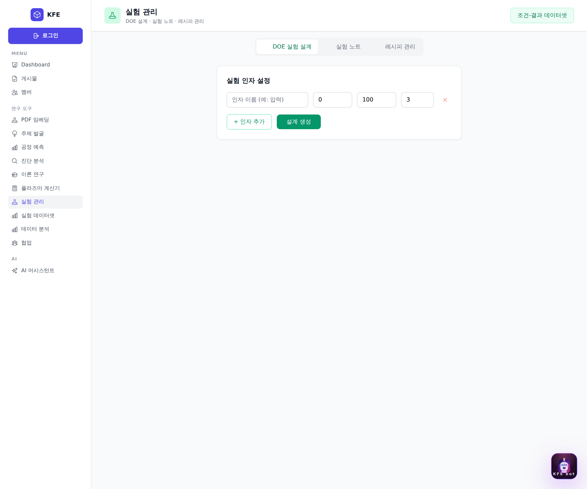

### 5.2 실험 데이터셋
- URL: `/experiment/dataset`
- 역할: 실험 조건, 결과, 근거를 구조화된 데이터 레코드로 저장하고 검색하는 화면입니다.
- 주요 기능:
  - 프로젝트 필터
  - 컬렉션 필터
  - 제목/태그/메모 검색
  - 데이터 레코드 생성/수정/삭제
  - 조건 JSON 입력
  - 결과 JSON 입력
  - 근거 참조 JSON 입력
- 사용하는 방법:
  1. 프로젝트나 컬렉션으로 목록을 좁힙니다.
  2. 새 레코드를 생성합니다.
  3. 조건, 결과, 근거를 구조화해 입력합니다.
  4. 저장 후 검색/수정 기능으로 누적 관리합니다.

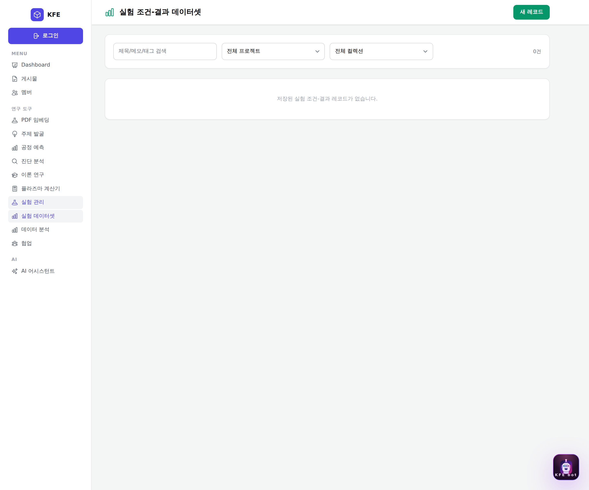

---

## 6. 협업과 결과 공유

### 협업
- URL: `/collaboration`
- 역할: 프로젝트, 토론, 활동 로그, 보고서 초안 생성을 지원하는 팀 협업 화면입니다.
- 주요 기능:
  - 프로젝트 생성/수정/삭제
  - 컬렉션 연결
  - 상태/태그 관리
  - 토론 작성/수정/삭제
  - 활동 타임라인 확인
  - 보고서 생성
  - 발표 자료 초안 확인
- 사용하는 방법:
  1. 협업 프로젝트를 생성합니다.
  2. 관련 컬렉션과 주제를 연결합니다.
  3. 팀 토론과 활동 로그를 정리합니다.
  4. 보고서 초안이나 발표 자료를 생성해 공유합니다.

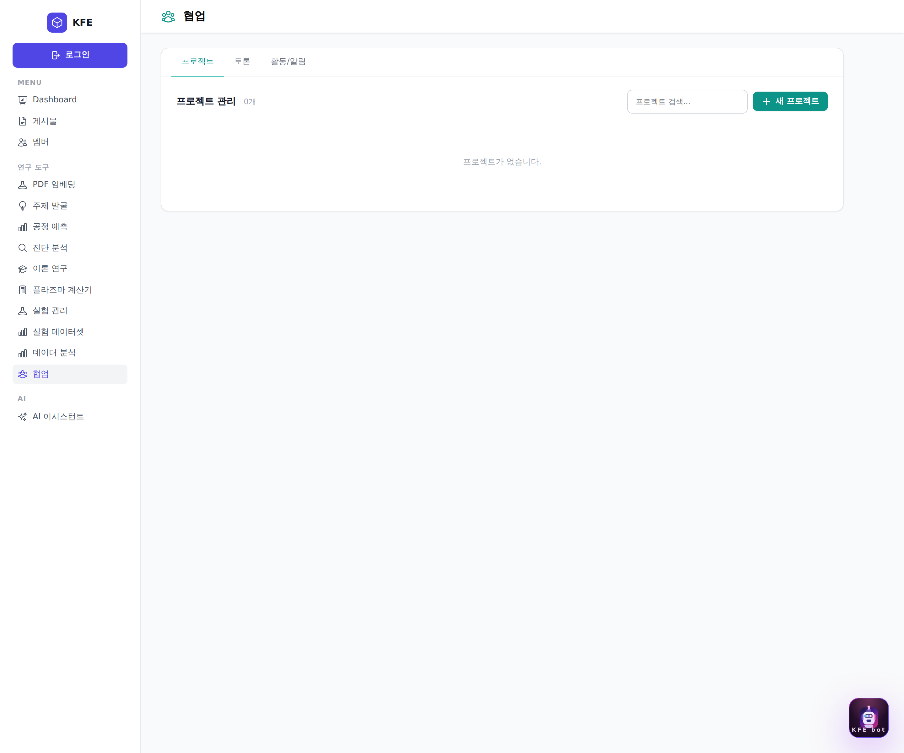

---

## 7. 연구자 설명 시 추천 멘트

- `메인 페이지`: “이 포털이 연구 탐색부터 실험 결과 정리까지 어떻게 이어지는지 보여주는 지도입니다.”
- `PDF 임베딩`: “논문을 업로드해서 검색 가능한 연구 데이터베이스로 만드는 단계입니다.”
- `연구 주제 발굴`: “무엇을 연구할지, 어디가 공백인지, 어떤 논문을 먼저 봐야 할지 정하는 화면입니다.”
- `이론 연구`: “수식과 가정을 비교하며 이론적 근거를 정리하는 화면입니다.”
- `Agent`: “질문을 넣으면 어떤 페이지를 써야 하는지, 왜 그런지까지 보여주는 연구 가이드입니다.”
- `분석/진단/예측`: “문헌 탐색을 실제 데이터 해석과 공정 의사결정으로 연결하는 도구들입니다.”
- `실험 관리/데이터셋`: “실험 조건과 결과를 쌓아 다음 연구의 자산으로 만드는 공간입니다.”
- `협업`: “혼자 찾은 근거와 실험 결과를 팀 문서와 발표자료로 연결하는 화면입니다.”

---

## 8. 한 줄 요약

**논문 업로드 → 연구 주제 탐색 → 이론/진단/예측 분석 → 실험 설계 및 데이터 축적 → 협업 및 보고서 생성**

필요하면 이 문서를 바탕으로 발표용 1페이지 요약본으로 다시 줄여서 만들 수 있습니다.
# Plasma Research Portal 사용 안내서

대상 사이트: http://172.21.38.128:3000/

이 문서는 연구자에게 포털의 주요 페이지와 기능을 소개하기 위한 안내서입니다.
`dashboard`, `게시물`, `멤버` 관련 화면은 제외하고 실제 연구 업무에 활용할 수 있는 화면만 정리했습니다.

---

## 1. 시작하기

### 로그인
- 로그인 페이지: `/access`
- 계정이 있으면 이메일과 비밀번호로 로그인합니다.
- 로그인 후에는 연구 화면으로 이동해 바로 기능을 사용할 수 있습니다.

### 추천 사용 순서
처음 사용하는 연구자라면 아래 순서를 권장합니다.

1. `PDF 임베딩`에서 논문 PDF를 업로드하고 컬렉션을 만듭니다.
2. `연구 주제 발굴` 또는 `Agent 챗봇`에서 탐색을 시작합니다.
3. 필요에 따라 `이론`, `진단`, `예측`, `데이터 분석`, `계산기` 페이지로 이동합니다.
4. 실험을 계획하거나 기록할 때 `실험 관리`, `실험 데이터셋`을 사용합니다.
5. 팀 단위 정리는 `협업` 페이지에서 진행합니다.

---

## 2. 데이터 준비 및 문헌 기반 연구

### PDF 임베딩
- URL: `/embedding`
- 역할: 논문 PDF를 업로드하고 검색 가능한 컬렉션으로 만드는 핵심 준비 화면입니다.
- 주요 기능:
  - 임베딩 모델 선택
  - 컬렉션 생성/삭제
  - PDF 다중 업로드
  - 청킹 전략 설정
  - 추출 미리보기
  - 처리 로그 및 통계 확인
- 사용 방법:
  1. 임베딩 모델을 선택합니다.
  2. 새 컬렉션을 만들거나 기존 컬렉션을 선택합니다.
  3. PDF 파일을 업로드합니다.
  4. 필요하면 청크 크기, 오버랩 등 옵션을 조정합니다.
  5. 임베딩 실행 후 통계와 로그를 확인합니다.
- 추천 대상:
  - 새 프로젝트를 시작하는 연구자
  - 문헌 기반 분석을 하기 전에 데이터베이스를 먼저 구축해야 하는 경우

### 연구 주제 발굴
- URL: `/research`
- 역할: 컬렉션에 쌓인 논문을 바탕으로 연구 주제, 갭, 가설, 추천 논문을 탐색하는 핵심 연구 페이지입니다.
- 주요 기능:
  - 컬렉션 선택
  - 주제 탐색 검색
  - 추천 주제 확인
  - Research Gap Detector
  - 가설 생성
  - 키워드 분석
  - 논문 추천
  - 제안서 생성
  - 특허 검색
  - PDF 원문 열기
- 사용 방법:
  1. 컬렉션을 선택합니다.
  2. 연구 키워드나 질문을 입력해 탐색을 시작합니다.
  3. 추천 주제와 근거 논문을 확인합니다.
  4. 필요 시 갭 분석, 가설 생성, 키워드 분석으로 확장합니다.
  5. 유망한 결과는 PDF 원문을 열어 검토합니다.
- 활용 예시:
  - “플라즈마 에칭에서 최근 주목받는 연구 주제는 무엇인가?”
  - “현재 연구 공백이 큰 영역은 무엇인가?”

### 이론 연구
- URL: `/theory`
- 역할: 문헌에서 수식, 가정, 개념 관계를 추출해 이론 중심 연구를 돕는 화면입니다.
- 주요 기능:
  - 수식 검색
  - 수식 분류/통계
  - 전체 수식 추출
  - 가정 검증
  - 문서 간 호환성 비교
  - 이론 그래프 구축 및 탐색
- 사용 방법:
  1. 컬렉션을 선택합니다.
  2. 수식 검색 또는 가정 검증 탭을 선택합니다.
  3. 관심 수식이나 가정을 검색합니다.
  4. 이론 그래프를 통해 개념 연결과 영향 관계를 확인합니다.
- 활용 예시:
  - 특정 플라즈마 모델의 주요 식을 찾고 비교
  - 논문별 가정 차이를 정리

---

## 3. 분석, 진단, 예측 도구

### 데이터 분석
- URL: `/analysis`
- 역할: 데이터를 빠르게 시각화하고 통계/피팅 분석을 수행하는 범용 분석 화면입니다.
- 주요 기능:
  - 데이터 플로터
  - 다양한 차트 표시
  - 기초 통계 분석
  - 커브 피팅
  - 최근 분석 이력 확인
- 사용 방법:
  1. 데이터를 입력하거나 불러옵니다.
  2. 플롯/통계/피팅 중 원하는 분석 탭을 선택합니다.
  3. X/Y 컬럼 또는 피팅 모델을 선택합니다.
  4. 결과 그래프와 지표를 확인합니다.
- 활용 예시:
  - 실험 결과를 빠르게 시각화
  - 추세선과 적합도 확인

### 진단 데이터 분석
- URL: `/diagnosis`
- 역할: 플라즈마 진단 데이터와 문헌을 함께 활용해 이상 탐지와 고장 분석까지 수행하는 화면입니다.
- 주요 기능:
  - 진단 방법별 문헌 검색
  - OES 스펙트럼 업로드
  - 유사 스펙트럼 검색
  - 관련 논문 검색
  - 멀티모달 검색
  - 이상 탐지
  - 고장 증상 기반 원인 분석
  - 진단 방법 비교
  - Boltzmann Plot, Langmuir Probe, Actinometry 관련 기능
- 사용 방법:
  1. 컬렉션을 선택합니다.
  2. 스펙트럼을 업로드하거나 진단 키워드를 입력합니다.
  3. 유사 스펙트럼과 논문을 확인합니다.
  4. 이상 탐지 또는 고장 진단 기능으로 문제 원인을 추적합니다.
- 활용 예시:
  - 비정상 OES 패턴이 어떤 고장 시나리오와 유사한지 확인
  - 특정 진단 방법에 대한 관련 문헌 탐색

### 공정 예측 모델링
- URL: `/prediction`
- 역할: 문헌과 파라미터 정보를 바탕으로 공정 결과를 예측하거나 목표 결과에 맞는 조건을 역설계하는 화면입니다.
- 주요 기능:
  - 조건 예측
  - Surrogate Model 기반 예측
  - 예측 신뢰구간 확인
  - 파라미터 DB 추출 및 통계
  - 역설계
  - 불확실성 분석
  - 파라미터 영향 분석
- 사용 방법:
  1. 컬렉션을 선택합니다.
  2. 예측할 조건 또는 목표 결과를 입력합니다.
  3. 예측 또는 역설계를 실행합니다.
  4. 추천 조건, 신뢰도, 영향 분석 결과를 확인합니다.
- 활용 예시:
  - “식각 속도를 높이기 위한 조건 범위는?”
  - “목표 균일도를 만족하는 파라미터 조합은?”

### 플라즈마 계산기
- URL: `/calculator`
- 역할: 플라즈마 연구에 필요한 계산, 단위 변환, 상수/가스/장비 참조를 제공하는 유틸리티 화면입니다.
- 주요 기능:
  - Debye 길이 계산
  - 플라즈마 주파수 계산
  - 단위 변환
  - 물리 상수 검색
  - 주요 수식 참고
  - Paschen 곡선 계산
  - 가스 DB
  - 장비 참조표
- 사용 방법:
  1. 계산 또는 참조 탭을 선택합니다.
  2. 필요한 입력값을 넣습니다.
  3. 계산 결과 또는 참조 정보를 확인합니다.
- 활용 예시:
  - 빠른 기본 물리량 계산
  - 실험 전 가스/장비 특성 확인

---

## 4. 실험 및 데이터 운영

### 실험 관리
- URL: `/experiment`
- 역할: DOE 설계, 실험 노트, 레시피 관리를 한곳에서 수행하는 화면입니다.
- 주요 기능:
  - DOE 인자 추가/삭제
  - 범위와 수준 기반 설계 생성
  - 실험 매트릭스 확인
  - 실험 노트 작성/검색/수정/삭제
  - AI 노트 초안 생성
  - 레시피 생성/수정/삭제
  - 데이터셋 화면으로 연결
- 사용 방법:
  1. DOE 탭에서 변수와 수준을 입력합니다.
  2. 설계를 생성해 실험 조합을 확인합니다.
  3. 노트 탭에서 실험 기록을 남깁니다.
  4. 레시피를 저장해 반복 실험에 활용합니다.
  5. 결과는 데이터셋 페이지로 넘겨 구조화합니다.
- 활용 예시:
  - RF power, pressure, gas ratio 조합 설계
  - 실험 진행 중 노트와 조건을 함께 기록

### 실험 데이터셋
- URL: `/experiment/dataset`
- 역할: 실험 조건, 결과, 근거를 구조화된 레코드로 저장하고 검색하는 화면입니다.
- 주요 기능:
  - 프로젝트 필터
  - 컬렉션 필터
  - 제목/태그/메모 검색
  - 데이터 레코드 생성/수정/삭제
  - 조건 JSON 입력
  - 결과 JSON 입력
  - 근거 참조 JSON 입력
- 사용 방법:
  1. 프로젝트나 컬렉션 기준으로 목록을 좁힙니다.
  2. 새 레코드를 생성합니다.
  3. 조건, 결과, 근거를 입력합니다.
  4. 저장 후 검색과 수정 기능으로 관리합니다.
- 비고:
  - 조건/결과를 구조화해 예측 모델이나 후속 분석에 연결할 때 유용합니다.

---

## 5. 협업 및 AI 지원

### 협업
- URL: `/collaboration`
- 역할: 프로젝트, 토론, 활동 로그, 보고서 초안 생성을 지원하는 협업 화면입니다.
- 주요 기능:
  - 프로젝트 생성/수정/삭제
  - 컬렉션 연결
  - 상태/태그 관리
  - 토론 작성/수정/삭제
  - 활동 타임라인 확인
  - 보고서 생성
  - 발표 자료 초안 확인
- 사용 방법:
  1. 협업 프로젝트를 생성합니다.
  2. 관련 컬렉션과 주제를 연결합니다.
  3. 토론과 활동 로그를 정리합니다.
  4. 보고서 초안이나 발표 자료를 생성합니다.
- 활용 예시:
  - 공동 연구 프로젝트 운영
  - 실험 진행 상황과 연구 방향 공유

### Agent
- URL: `/agent`
- 역할: 사용자의 질문을 분석해 적절한 연구 도구 페이지로 연결해주는 AI 연구 어시스턴트입니다.
- 주요 기능:
  - 채팅 입력
  - 추천 질문 버튼
  - 실시간 스트리밍 응답
  - tool 실행 로그 표시
  - 추천 페이지 안내
  - 자동 페이지 이동 제안
- 사용 방법:
  1. 자연어로 질문을 입력합니다.
  2. 에이전트가 분석 경로와 추천 페이지를 제안합니다.
  3. 제안된 페이지로 이동해 상세 작업을 이어갑니다.
- 활용 예시:
  - “ICP 에칭 조건을 예측하려면 어디서 시작해야 하나?”
  - “OES 데이터 이상 탐지는 어느 화면에서 보는 게 좋은가?”

### Agent 챗봇
- URL: `/agent/v2`
- 역할: 페이지 handoff, 실행 결과, 답변 품질을 카드 형태로 보여주는 실험형 AI 어시스턴트입니다.
- 주요 기능:
  - 컬렉션 선택
  - 스트리밍 채팅
  - 페이지 이동 카드
  - 실행된 페이지 결과 카드
  - 답변 품질 분석 카드
  - 최종 답변 카드
  - 근거 문헌 카드
- 사용 방법:
  1. 질문을 입력합니다.
  2. 추천된 페이지와 결과 요약을 확인합니다.
  3. 자동 이동 또는 후속 탐색을 이어갑니다.

## 6. 한 줄 요약

이 포털은 다음 흐름으로 이해하면 쉽습니다.

**문헌 업로드 → 연구 주제 탐색 → 이론/진단/예측 분석 → 실험 설계 및 데이터 축적 → 협업 및 보고서 생성**

필요하면 이 문서를 바탕으로 발표용 HTML 버전이나, 연구자 배포용 1페이지 요약본으로 다시 정리할 수 있습니다.